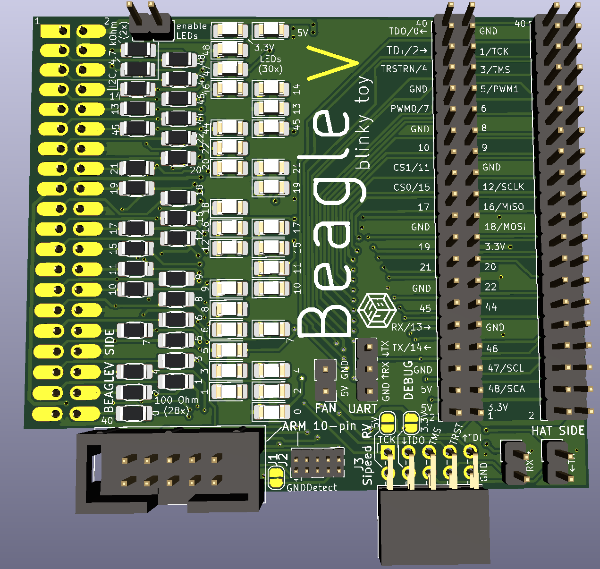
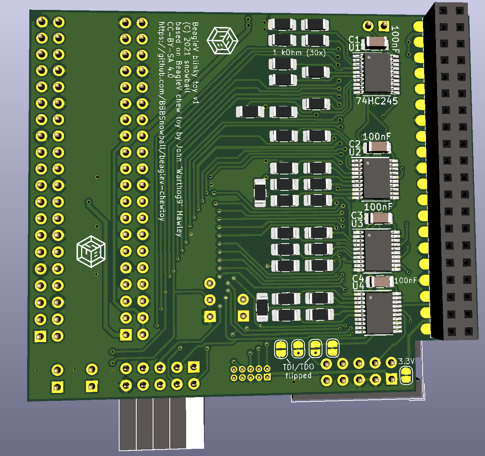

This is a fairly simple little board targetted at the BeagleV, but likely usable for anything that uses a 2x20 pin header.

The board takes the existing 2x20 header and either via a through-hole, or smt, header extends it away from the board
(assuming the connector is on the edge), and rotates it 180deg so if you happen to have a large heat sink, or something
else that's blocking the pins they might still be accessible for hats, etc. Most pre-production beta BeagleV boards have a
large heatsink out of an abundance of caution but this is not required and won't be used for production units.

This fork adds:
- LEDs: They are behind a buffer so the SoC or external device doesn't have to drive their current.
- series resistors: They provide some protection if you accidentally connect two outputs or while the SoC is driving
  the pins during reset. Remove them or use lower values if they impact high speed signals.
- JTAG headers: ARM 10-pin (2.54 mm and 1.27 mm, via ribbon cable), Sipeed RV Debugger (directly plugged into the board)
- a second header for debugging (e.g. attach a hat and a logic analyzer at the same time)
- UART connector
- pullups for I2C

All additional features are optional. Don't place the things that you don't need and you can close the solder jumper
below the series resistors if you don't want those. However, if you don't need any of them, I suggest that you use warthog9's
board: It's half the size and doesn't extend to the sides. Mine sacrifices that for a bit more functionality.

Jumpers:
- enable LEDs
- enable RX/TX on the Sipeed connector
  - You have to disable that if you want to use a different UART adapter, e.g. if you
    have trouble assigning different drivers to the parts of the FT2232H on Windows.
  - If you are on Linux, close the solder jumpers and omit the jumpers.
- connect 3.3V and/or 5V to Sipeed connector (solder jumpers)
  - The adapter doesn't need any reference voltage and it doesn't provide enough current to power the board so you should keep them open.
- swap TDI/TDO on the ARM connectors (solder jumpers)
  - I haven't tested the pinout yet so just in case...
- disconnect GND from pin 9 of the ARM connectors (GNDDetect)
- disconnect 3.3V from pin 1 of the ARM connectors
  - JTAG adapters with level shifters will use this to detect the target voltage.
  - If your adapter tries to power the target via this pin, cut the jumper to avoid that.

# Where to get one built

* OSH Park https://oshpark.com/shared_projects/uNRCdQbW (TODO: update this for the fork)

# License and Copyright
(C) John 'Warthog9' Hawley 2021, snowball 2021
CC-BY-SA 4.0
